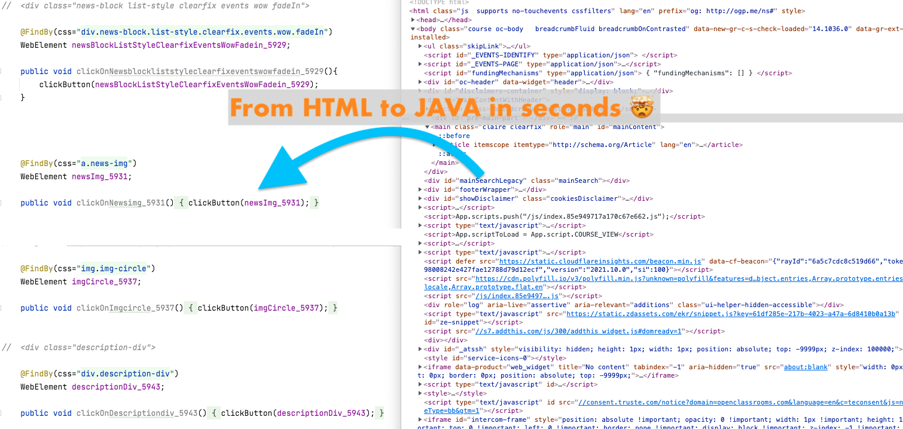

# Selenim JAVA Generator

### Script to convert from <b>HTML</b> to Java Selenium object (<span><b>WebElement</b></span>)


> <b style="color:red;">SUPPORT </b>
   > * Support read HTML from <b>File</b> or <b>URL</b>
   > * Support <span style="background-color: #ebd69d;">@FindBy(id = "css_element")</span>
   > * Support <span style="background-color: #ebd69d;">@FindBy(css = "css_element")</span>
   > * Build function to click on item
   > * You can custom your <b>REGEX</b> pattern

<br>




## <span style="color: #bc596a;">How to use it 👨🏻‍💻</span>
* <b>First:</b> Clone the project to your device

* <b>Second:</b> Run the following command

```shell
    ruby user_console.rb
```
* <b>Third:</b> You will see message output follow the instructions

* <b>Forth:</b> Follow the following youtube video for more information

</br>

## <span style="color: #bc596a;">Default value can be change</span>

* Sometimes <b>id</b> or <b>class</b> contain some following words so it will ignore still you can change it
</br>

```ruby
    <!-- <div class="https://....com"> -->

    $array_rules_not_include = ["https://", "about:blank", "_blank", "rel=", "target="]
```

* The following <b>REGEX</b> ignore any type that contain special chars
</br>

```ruby
    <!-- <div class="btn[[type]]">  -->
    
    $special_char_to_match = /[!@#$%^&*().?":{}\[\]|<>;]/
```

* If you did not specify <b>class JAVA name</b> the default will be
</br>

```ruby
    $java_class_name = "SeleniumJavaGenerator"
```